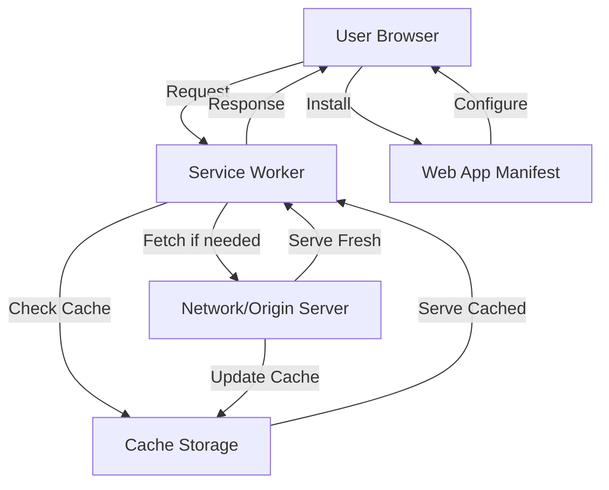

# Design Document: Shri Pandit Ji PWA

## Overview

This design document outlines the technical architecture for converting the Shri Pandit Ji website (https://shripanditji.in/) into a Progressive Web App (PWA) with offline capabilities, installability, and Android APK conversion support.

The PWA will wrap the existing website content while adding modern web capabilities including:
- Service worker-based offline functionality
- App-like installation experience
- Optimized caching strategies
- Native app packaging via Trusted Web Activity (TWA)

The implementation follows the App Shell architecture pattern, where the core application structure is cached separately from dynamic content, enabling fast, reliable performance even on unreliable networks.

## Architecture

### High-Level Architecture



### Application Layers

1. **Presentation Layer**: HTML/CSS/JavaScript UI that wraps the Shri Pandit Ji website
2. **Service Worker Layer**: Background script managing caching, offline functionality, and network requests
3. **Cache Layer**: Browser cache storage for static assets and dynamic content
4. **Network Layer**: Communication with the origin server (shripanditji.in)

### Caching Architecture

The PWA implements a multi-strategy caching approach:

- **App Shell (Cache First)**: Core HTML, CSS, JavaScript files cached on install
- **Website Content (Network First)**: Dynamic content from shripanditji.in with cache fallback
- **Images (Stale While Revalidate)**: Serve cached images while updating in background
- **Static Assets (Cache First)**: Fonts, icons, and other static resources

## Components and Interfaces

### 1. Web App Manifest (manifest.json)

**Purpose**: Provides metadata for PWA installation and appearance

**Interface**:
```javascript
{
  name: string,              // Full application name
  short_name: string,        // Name for home screen (max 12 chars)
  description: string,       // App description
  start_url: string,         // Entry point URL
  display: string,           // Display mode: "standalone"
  orientation: string,       // Screen orientation: "portrait"
  theme_color: string,       // Browser UI color (hex)
  background_color: string,  // Splash screen background (hex)
  scope: string,             // Navigation scope
  icons: Array<{
    src: string,             // Icon file path
    sizes: string,           // Icon dimensions (e.g., "192x192")
    type: string,            // MIME type (e.g., "image/png")
    purpose: string          // "any" or "maskable"
  }>
}
```

**Configuration**:
- Name: "Shri Pandit Ji"
- Short name: "Pandit Ji"
- Display: "standalone" (hides browser UI)
- Theme color: Derived from website branding
- Icons: 192x192, 512x512 (standard and maskable)

### 2. Service Worker (sw.js)

**Purpose**: Manages caching, offline functionality, and resource fetching

**Key Functions**:

```javascript
// Installation - cache app shell
install(event: ExtendableEvent): void

// Activation - clean up old caches
activate(event: ExtendableEvent): void

// Fetch interception - implement caching strategies
fetch(event: FetchEvent): void

// Cache management
cacheAppShell(cacheName: string, resources: string[]): Promise<void>
getCachedResponse(request: Request): Promise<Response | undefined>
updateCache(request: Request, response: Response): Promise<void>
cleanOldCaches(currentVersion: string): Promise<void>
```

**Caching Strategies Implementation**:

```javascript
// Strategy 1: Cache First (for app shell)
function cacheFirst(request) {
  return caches.match(request)
    .then(cached => cached || fetch(request))
}

// Strategy 2: Network First (for HTML pages)
function networkFirst(request) {
  return fetch(request)
    .then(response => {
      updateCache(request, response.clone())
      return response
    })
    .catch(() => caches.match(request))
}

// Strategy 3: Stale While Revalidate (for images)
function staleWhileRevalidate(request) {
  const cached = caches.match(request)
  const fetched = fetch(request).then(response => {
    updateCache(request, response.clone())
    return response
  })
  return cached.then(response => response || fetched)
}
```

### 3. Main Application (index.html)

**Purpose**: Entry point that registers service worker and provides app shell

**Key Elements**:
- Meta tags for mobile optimization
- Link to manifest.json
- Service worker registration script
- App shell HTML structure
- Install prompt UI
- Iframe or content wrapper for shripanditji.in

**Service Worker Registration**:
```javascript
if ('serviceWorker' in navigator) {
  navigator.serviceWorker.register('/sw.js')
    .then(registration => {
      console.log('SW registered:', registration)
      checkForUpdates(registration)
    })
    .catch(error => {
      console.error('SW registration failed:', error)
    })
}
```

### 4. Install Manager (install.js)

**Purpose**: Handles PWA installation prompt and tracking

**Interface**:
```javascript
class InstallManager {
  // Store deferred prompt event
  deferredPrompt: BeforeInstallPromptEvent | null
  
  // Initialize install prompt listener
  init(): void
  
  // Show custom install UI
  showInstallButton(): void
  
  // Hide install UI after installation
  hideInstallButton(): void
  
  // Trigger installation flow
  promptInstall(): Promise<void>
  
  // Track installation outcome
  trackInstallation(outcome: 'accepted' | 'dismissed'): void
}
```

### 5. Offline Page (offline.html)

**Purpose**: Fallback page displayed when offline and content not cached

**Features**:
- App branding and logo
- Clear offline status message
- List of cached pages (if available)
- Retry button
- Minimal styling (must be cached)

### 6. Cache Manager

**Purpose**: Manages cache versioning and cleanup

**Interface**:
```javascript
class CacheManager {
  version: string              // Current cache version
  maxCacheSize: number         // Maximum cache entries
  maxCacheAge: number          // Maximum cache age in ms
  
  // Get current cache name with version
  getCacheName(): string
  
  // Add resources to cache
  addToCache(cacheName: string, resources: string[]): Promise<void>
  
  // Remove old cache versions
  cleanOldCaches(): Promise<void>
  
  // Enforce cache size limits
  enforceCacheLimits(cacheName: string): Promise<void>
  
  // Clear expired cache entries
  clearExpiredEntries(cacheName: string): Promise<void>
}
```

### 7. Asset Links Configuration (assetlinks.json)

**Purpose**: Enables TWA verification for Android APK

**Interface**:
```javascript
[{
  relation: ["delegate_permission/common.handle_all_urls"],
  target: {
    namespace: "android_app",
    package_name: string,      // Android package name
    sha256_cert_fingerprints: [string]  // App signing certificate
  }
}]
```

## Data Models

### Cache Entry

```javascript
interface CacheEntry {
  request: Request           // Original request
  response: Response         // Cached response
  timestamp: number          // Cache time (ms since epoch)
  strategy: CacheStrategy    // Applied caching strategy
}

type CacheStrategy = 
  | 'cache-first'
  | 'network-first' 
  | 'stale-while-revalidate'
```

### Installation State

```javascript
interface InstallationState {
  isInstallable: boolean     // PWA meets install criteria
  isInstalled: boolean       // PWA is currently installed
  promptShown: boolean       // Install prompt was displayed
  userChoice: 'accepted' | 'dismissed' | null
}
```

### Service Worker State

```javascript
interface ServiceWorkerState {
  registration: ServiceWorkerRegistration | null
  isActive: boolean          // SW is active and controlling pages
  isUpdating: boolean        // SW update in progress
  version: string            // Current SW version
}
```

### PWA Configuration

```javascript
interface PWAConfig {
  appName: string
  shortName: string
  themeColor: string
  backgroundColor: string
  startUrl: string
  scope: string
  cacheVersion: string
  cacheDuration: number      // Cache TTL in ms
  maxCacheSize: number       // Max cached items
  offlinePages: string[]     // Pages to cache for offline
}
```

## Correctness Properties


*A property is a characteristic or behavior that should hold true across all valid executions of a system—essentially, a formal statement about what the system should do. Properties serve as the bridge between human-readable specifications and machine-verifiable correctness guarantees.*

### Property 1: Cache-First Strategy for Static Assets

*For any* static asset request (CSS, JavaScript, fonts), when the resource exists in cache, the service worker should serve it from cache without making a network request.

**Validates: Requirements 3.4, 7.1**

### Property 2: Offline Fallback for Uncached Resources

*For any* network request that fails when offline, if the requested resource is not in cache, the service worker should return the offline fallback page.

**Validates: Requirements 3.5**

### Property 3: Network-First Strategy for HTML Pages

*For any* HTML page request, the service worker should attempt to fetch from the network first, and only serve from cache if the network request fails.

**Validates: Requirements 7.2**

### Property 4: Stale-While-Revalidate Strategy for Images

*For any* image request, the service worker should serve the cached version immediately (if available) while simultaneously fetching an updated version from the network to update the cache.

**Validates: Requirements 7.3**

### Property 5: Cache Size Limit Enforcement

*For any* cache storage, the number of cached entries should never exceed the configured maximum cache size limit.

**Validates: Requirements 7.5**

### Property 6: FIFO Cache Eviction Policy

*For any* cache that has reached its size limit, when a new item is added, the oldest cached item (by timestamp) should be removed first.

**Validates: Requirements 7.6**

### Property 7: HTTPS-Only Resources

*For any* resource URL referenced in the manifest, HTML, or cached by the service worker, the protocol should be HTTPS (no mixed content).

**Validates: Requirements 8.4**

### Property 8: Touch Target Minimum Size

*For any* interactive UI element (buttons, links, form inputs), the touch target dimensions should be at least 44x44 pixels.

**Validates: Requirements 6.6**

### Property 9: Image File Size Optimization

*For any* image asset included in the PWA, the file size should be below the configured threshold for its dimensions (e.g., < 200KB for standard images).

**Validates: Requirements 9.4**

## Error Handling

### Service Worker Errors

**Registration Failures**:
- If service worker registration fails, log error to console
- Display fallback message to user
- Allow app to function without offline capabilities
- Retry registration on next page load

**Fetch Errors**:
- Network failures: Serve from cache or offline page
- Cache read failures: Attempt network fetch
- Both fail: Display offline page with error message

**Cache Errors**:
- Cache write failures: Log error, continue without caching
- Cache quota exceeded: Trigger cache cleanup, retry
- Cache corruption: Clear affected cache, rebuild

### Installation Errors

**Manifest Errors**:
- Invalid JSON: Log error, prevent installation
- Missing required fields: Log warning, may prevent installation
- Invalid icon paths: Log warning, use fallback icons

**Install Prompt Errors**:
- beforeinstallprompt not fired: Hide install button
- User dismisses prompt: Track dismissal, show button again later
- Installation fails: Log error, allow retry

### Network Errors

**Origin Server Unavailable**:
- Serve cached content if available
- Display offline page for uncached content
- Show connection status indicator

**Timeout Errors**:
- Set reasonable timeout (10 seconds)
- Fall back to cache on timeout
- Retry with exponential backoff

### Content Loading Errors

**Iframe Loading Failures**:
- Display error message in iframe
- Provide retry button
- Log error for debugging

**Asset Loading Failures**:
- Use fallback assets (fonts, images)
- Degrade gracefully without critical assets
- Log missing assets for investigation

## Testing Strategy

### Unit Testing

Unit tests will verify specific examples, edge cases, and error conditions for individual components:

**Manifest Validation Tests**:
- Verify manifest.json contains all required fields
- Verify icon sizes and formats are correct
- Verify color values are valid hex codes
- Verify URLs are properly formatted

**Service Worker Tests**:
- Test service worker registration succeeds
- Test install event caches app shell resources
- Test activate event cleans up old caches
- Test fetch event routing to correct strategy
- Test offline fallback page is served when appropriate

**Cache Manager Tests**:
- Test cache versioning creates unique cache names
- Test cache cleanup removes old versions
- Test cache size limit enforcement
- Test FIFO eviction when cache is full
- Test expired entry removal

**Install Manager Tests**:
- Test beforeinstallprompt event is captured
- Test install button shows/hides correctly
- Test prompt() is called when button clicked
- Test installation tracking works

**Error Handling Tests**:
- Test service worker registration failure handling
- Test network timeout handling
- Test cache write failure handling
- Test manifest parse error handling

### Property-Based Testing

Property tests will verify universal properties across all inputs using a property-based testing library (fast-check for JavaScript/TypeScript). Each test should run a minimum of 100 iterations.

**Configuration**:
- Library: fast-check (npm install --save-dev fast-check)
- Minimum iterations: 100 per property
- Each test tagged with: **Feature: shripanditji-pwa, Property N: [property text]**

**Property Test Suite**:

1. **Cache-First Strategy Property Test**
   - Generate random static asset URLs
   - Add them to cache with mock responses
   - Verify service worker serves from cache without network access
   - Tag: **Feature: shripanditji-pwa, Property 1: Cache-First Strategy for Static Assets**

2. **Offline Fallback Property Test**
   - Generate random uncached URLs
   - Simulate offline network condition
   - Verify offline fallback page is returned
   - Tag: **Feature: shripanditji-pwa, Property 2: Offline Fallback for Uncached Resources**

3. **Network-First Strategy Property Test**
   - Generate random HTML page URLs
   - Verify network is attempted before cache
   - Verify cache is used only on network failure
   - Tag: **Feature: shripanditji-pwa, Property 3: Network-First Strategy for HTML Pages**

4. **Stale-While-Revalidate Property Test**
   - Generate random image URLs
   - Verify cached version served immediately
   - Verify network fetch happens in background
   - Tag: **Feature: shripanditji-pwa, Property 4: Stale-While-Revalidate Strategy for Images**

5. **Cache Size Limit Property Test**
   - Generate random number of cache entries (including over limit)
   - Add entries to cache
   - Verify cache never exceeds configured limit
   - Tag: **Feature: shripanditji-pwa, Property 5: Cache Size Limit Enforcement**

6. **FIFO Eviction Property Test**
   - Generate random cache entries with timestamps
   - Fill cache to limit
   - Add new entry
   - Verify oldest entry was removed
   - Tag: **Feature: shripanditji-pwa, Property 6: FIFO Cache Eviction Policy**

7. **HTTPS-Only Property Test**
   - Generate random resource URLs from manifest and HTML
   - Verify all URLs use HTTPS protocol
   - Verify no mixed content
   - Tag: **Feature: shripanditji-pwa, Property 7: HTTPS-Only Resources**

8. **Touch Target Size Property Test**
   - Generate random interactive elements
   - Measure computed dimensions
   - Verify all meet 44x44 minimum
   - Tag: **Feature: shripanditji-pwa, Property 8: Touch Target Minimum Size**

9. **Image Optimization Property Test**
   - Generate random image files
   - Check file sizes
   - Verify all are below threshold for their dimensions
   - Tag: **Feature: shripanditji-pwa, Property 9: Image File Size Optimization**

### Integration Testing

Integration tests will verify the complete PWA functionality:

- Test complete offline workflow (load → go offline → navigate)
- Test installation flow across browsers (Chrome, Edge, Safari)
- Test service worker update lifecycle
- Test cache strategies work together correctly
- Test PWA works when embedded in TWA/APK

### Lighthouse Auditing

Use Lighthouse CLI to verify PWA compliance:
- Run Lighthouse PWA audit
- Verify score ≥ 90%
- Check all PWA criteria pass
- Verify performance metrics meet targets

### Cross-Browser Testing

Test PWA functionality across:
- Chrome (Android & Desktop)
- Edge (Desktop)
- Safari (iOS & Desktop)
- Firefox (Desktop)

Verify:
- Service worker registration
- Installation capability
- Offline functionality
- Manifest parsing
- Icon display

### APK Testing

After generating APK with PWA Builder or Bubblewrap:
- Install APK on Android device
- Verify app launches correctly
- Verify TWA verification succeeds
- Verify offline functionality works
- Verify app appears in app drawer with correct icon

## Implementation Notes

### Development Workflow

1. **Setup Phase**:
   - Create project structure
   - Set up HTTPS development server (required for service workers)
   - Install development dependencies

2. **Core Implementation**:
   - Create manifest.json
   - Implement service worker with caching strategies
   - Create app shell HTML/CSS/JS
   - Generate icons in required sizes

3. **Testing Phase**:
   - Write unit tests for components
   - Write property tests for correctness properties
   - Run Lighthouse audit
   - Test across browsers

4. **APK Generation**:
   - Use PWA Builder (https://www.pwabuilder.com/) or
   - Use Bubblewrap CLI (https://github.com/GoogleChromeLabs/bubblewrap)
   - Configure assetlinks.json for TWA verification
   - Generate signed APK
   - Test APK on Android device

### Service Worker Development Tips

- Use Chrome DevTools → Application → Service Workers for debugging
- Use "Update on reload" during development
- Use "Bypass for network" to test without SW
- Clear cache frequently during development
- Test offline mode using DevTools Network throttling

### Caching Best Practices

- Cache app shell separately from content
- Use versioned cache names for updates
- Implement cache size limits to avoid quota issues
- Clean up old caches on activation
- Don't cache user-specific or sensitive data

### PWA Builder Configuration

When using PWA Builder for APK generation:
- Ensure manifest.json is complete and valid
- Provide all required icon sizes
- Configure package name (e.g., com.shripanditji.app)
- Set up signing key for production
- Configure assetlinks.json on origin server

### Bubblewrap Configuration

When using Bubblewrap CLI:
```bash
npm install -g @bubblewrap/cli
bubblewrap init --manifest https://shripanditji.in/manifest.json
bubblewrap build
```

Required configuration:
- Android package name
- App version code and name
- Signing key (generate with keytool)
- Host domain for TWA verification

### Deployment Checklist

- [ ] Deploy to HTTPS domain
- [ ] Upload assetlinks.json to /.well-known/assetlinks.json
- [ ] Verify manifest.json is accessible
- [ ] Verify service worker registers successfully
- [ ] Test installation on mobile devices
- [ ] Run Lighthouse audit (score ≥ 90%)
- [ ] Generate and test APK
- [ ] Submit APK to Google Play Store (optional)
